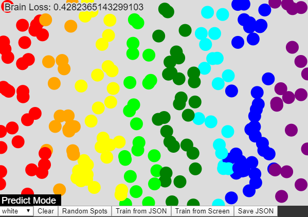

# Cover Carousel (Machine Learn)
A position classification by color using JavaScript.

In this project you are be able to classify positions in canvas by color using Machine Learn. There is a file to train in data folder, or you can train your own data by adding some points in canvas area.

After teaching the software, you get in "Predict Mode", in this mode, the software make some guesses based on mouse position and painting the spots.

You can try it in this link https://editor.p5js.org/RaphaelBruno/sketches/5ERczCVoR

## Libraries
* TensorFlow.js
* P5.js
